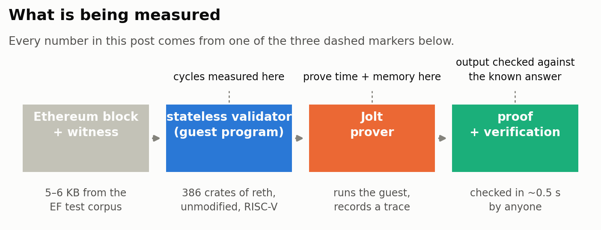
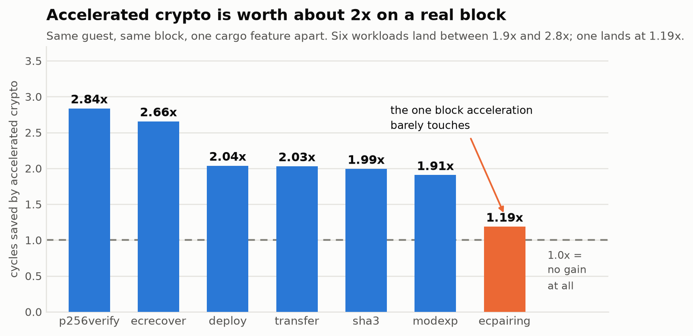
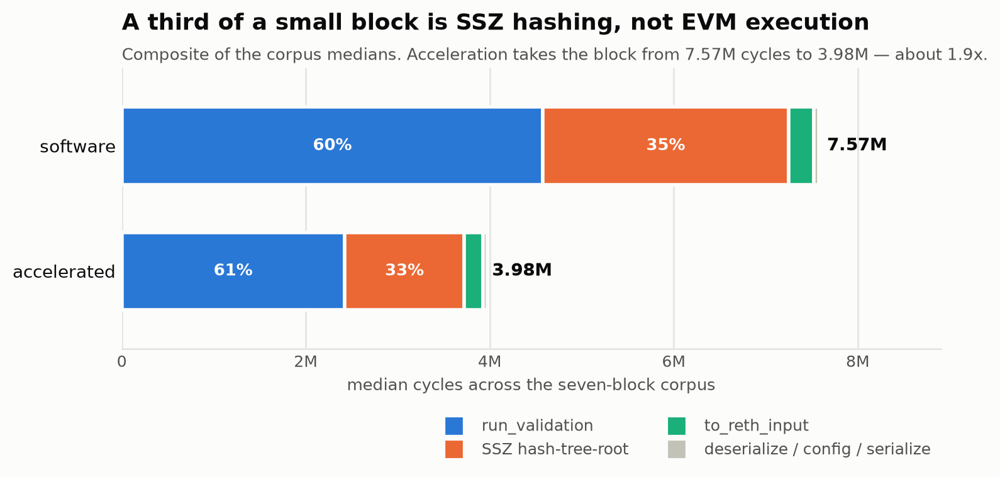
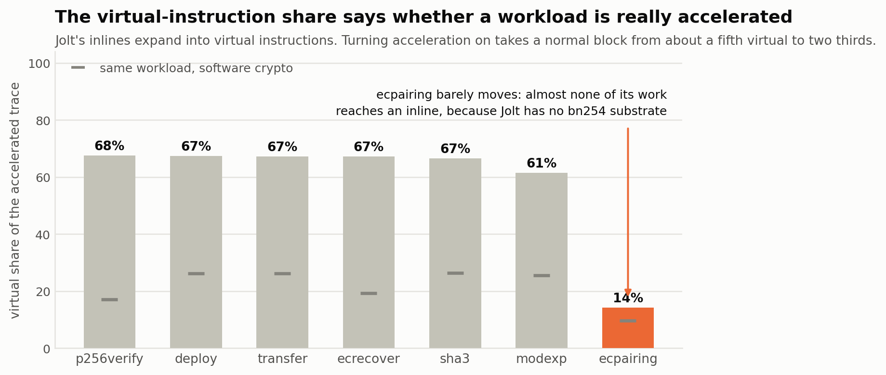
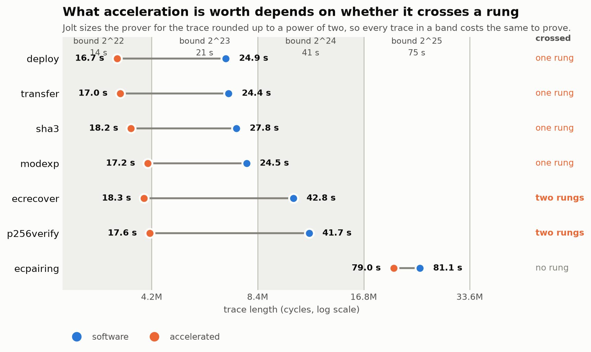
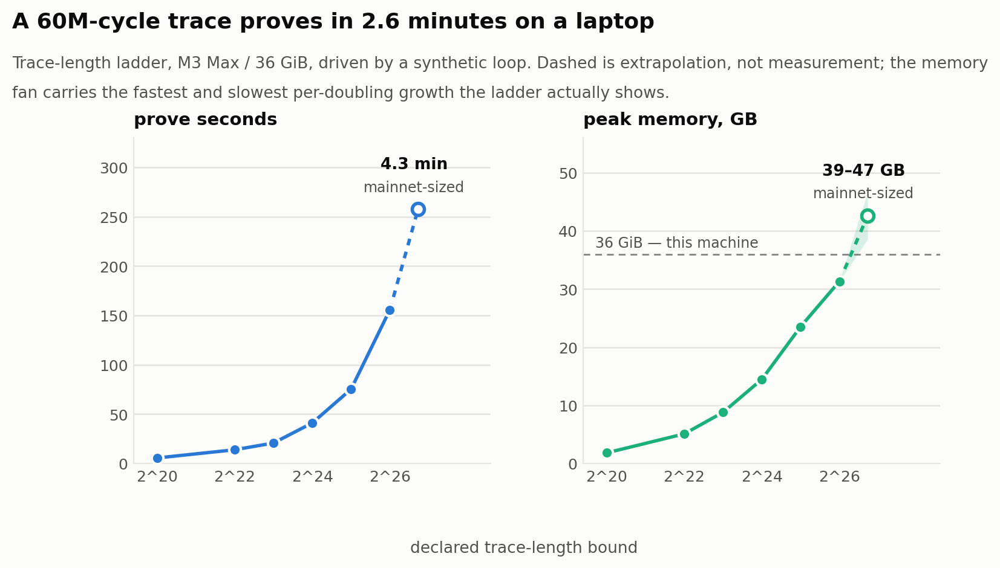
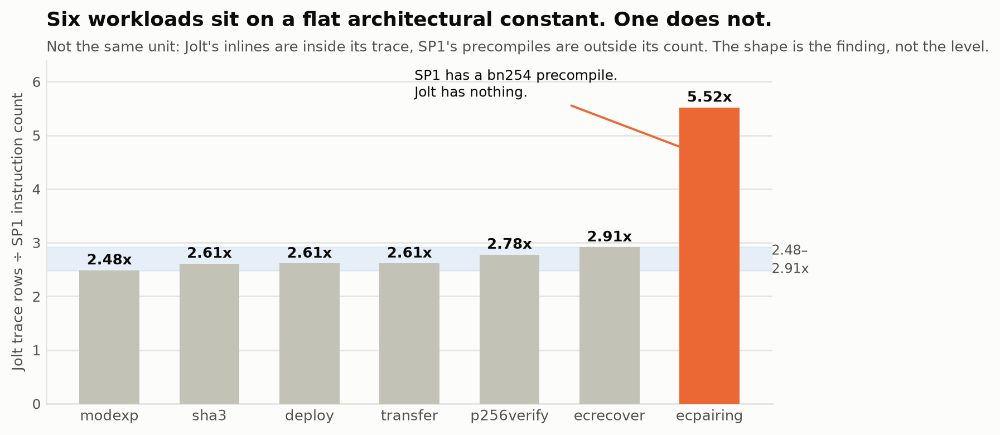

# I ran Ethereum block validation inside Jolt. Here's what I found.

Jolt is a zero-knowledge virtual machine from a16z crypto. It has a striking
design — no hand-written circuit per instruction, just lookups — and a lot of
attention. What it did not have, until now, was any evidence about whether it can
do the thing Ethereum actually wants a zkVM for.

So I built the integration and measured it. This post walks through what came out,
in order, starting from what the problem even is.

Everything here is reproducible: every number regenerates from raw JSON in the
repo, and the test suite fails if any table or chart has drifted from the data it
came from.

---

## What is being measured, and why

Ethereum has a scaling idea that goes like this. Today, every node re-executes
every block to know it's valid. That's a lot of duplicated work. Instead: have
*one* machine execute the block and produce a **cryptographic proof** that it did
so correctly. Everyone else checks the proof, which takes milliseconds.

For this to work you need block validation to be a self-contained computation —
no database, no network. That's **stateless validation**: you hand the validator a
block plus a *witness* containing exactly the pieces of Ethereum's state that this
block touches, along with proofs those pieces are real. The validator checks
everything against the parent block's state root. Self-contained, so it can run
inside a zkVM.

The Ethereum Foundation maintains the reference version of this — a Rust program
called `stateless-validator-reth` — plus a harness so different zkVMs can be
measured on the same program and the same test blocks, instead of each vendor
publishing its own benchmark. SP1, from Succinct, already plugged into it. Jolt
did not.

Two terms you need for the rest of this post:

**Cycles.** When the prover runs your program, it records every step in a big
table called a *trace*. One row per step. "Cycles" means rows in that table, and
it's the thing proving cost scales with. Fewer cycles, cheaper proof.

**The guest.** The program being proven, compiled to RISC-V. Here it's the EF's
stateless validator, unmodified.

---

## It runs, and that wasn't obvious

The first question was simply whether the EF's validator could be made to work on
Jolt at all. It's 386 crates of production Rust — `reth`, Ethereum's second-most
used client — compiled to a bare-metal RISC-V target with no operating system, no
allocator guarantees, and no standard library.

It worked, with one fix.

The one fix is a nice illustration of how these things break. Somewhere deep in
`reth`, hashing a block header caches the result in a `OnceCell`. `OnceCell` needs
a lock. Locks on bare metal need a `critical-section` implementation, and nobody
had written one for Jolt. So the link failed on a missing symbol with an
unhelpful name.

The fix is five lines and does nothing: a zkVM guest is single-threaded and can't
be interrupted, so "acquire the lock" is a no-op. But you have to know that. It
now lives in the platform crate so the next person doesn't lose an afternoon.

The result is a 2.1 MB RISC-V binary that proves real Ethereum test blocks and
produces output byte-identical to the answer the test fixture says is correct.

I also had to write one piece of cryptography myself. Ethereum's `ecrecover`
precompile — the thing that turns a signature into the address that signed it —
needs a *recovery* operation. Jolt ships signature *verification* but not
recovery. I implemented it using only Jolt's public API, so it works against an
unmodified checkout, and tested it against the reference implementation on 64
signatures plus edge cases.

---

## Accelerated crypto is worth about 2x, not 10x

Ethereum blocks are full of cryptography — hashing, signature checks. Doing that
in plain software inside a zkVM is expensive, so zkVMs offer accelerated versions.
The EF's harness has a standard way for a guest to call them.

So: run the same block twice, once with software crypto, once with Jolt's
accelerated versions. One cargo feature apart. How much faster?

**About 2x.** Best case 2.84x, worst case 1.19x.

If you were expecting 10x or 50x, that expectation is worth examining, because
it's common and it comes from a real difference between how Jolt and SP1 work.

In SP1, an accelerated operation is a **precompile**: the main program makes one
call, and the actual hashing happens in a *separate* piece of machinery with its
own circuit. The work leaves the main trace.

In Jolt, an accelerated operation is an **inline**: it expands into a sequence of
special instructions that run in the *same* trace as everything else. The work
gets cheaper, but it doesn't leave.

Concretely, I measured Jolt's keccak hash at 24.5 cycles per byte accelerated
against 60.5 in software. Of the ~3,334 cycles each hash permutation costs, about
75 are ordinary RISC-V instructions and about 3,259 are these expanded special
instructions. They're rows in the table just like everything else.

This is Jolt's documented design, not a discovery — [JoltBook](https://jolt.a16zcrypto.com/how/optimizations/inlines.html)
says inlines "remain fully integrated within the main Jolt zkVM execution model."
I mention it because the difference explains the 2x, and because a reader carrying
SP1's mental model across will keep expecting a bigger number.

> **A discrepancy I couldn't resolve.** Jolt's own benchmark page reports keccak at
> 26 cycles/byte accelerated against 78 in software, for 3.01x. My accelerated
> number matches theirs closely (24.5 vs 26). My *software baseline* doesn't — 60.5
> vs 78, a 29% gap, and that gap is the entire difference between my 2.47x and
> their 3.01x. Could be a library version, could be the target, could be my
> measurement. I've asked. Separately, Jolt's API reference page for the same
> function claims "~10-100x reduction in VM cycles," which disagrees with Jolt's
> own benchmark by more than an order of magnitude and is probably where the
> inflated expectation comes from.

---

## A third of a small block isn't the EVM at all

If someone asks you where the time goes in Ethereum block validation, the obvious
answer is "executing transactions." I instrumented the guest to find out.

Transaction execution is about 60%. But **a third of the block is one hashing
step** — computing a Merkle root over the payload, pure SHA-256, before any
transaction runs.

Two things follow. First, if you're optimising a stateless validator guest and you
only looked at the EVM, you missed a third of the work. Second, a caveat on my own
numbers: this share is inflated by the fact that public test blocks are tiny. That
hashing step scales with the block *header*, not with the number of transactions,
so on a real mainnet block with hundreds of transactions it would be a much
smaller slice. Read the split as "here is a component people forget," not as a
mainnet profile.

---

## One missing feature dominates everything

Look back at the speedup chart. Six blocks get roughly 2x. One block — `ecpairing`
— gets 1.19x, and it's also six times more expensive in absolute terms than a
simple transfer.

The cause is a gap. That block uses **bn254 pairings**, elliptic-curve
cryptography used by most of Ethereum's zero-knowledge and rollup infrastructure.
Jolt has no accelerated version of it, so the work falls through to plain
software. The 1.19x is the *hashing* in that block still being accelerated, around
a pairing operation that nothing touched.

What makes this worth trusting is that three independent measurements point at it.

**One: the speedup is flat.** 1.19x where everything else is ~2x.

**Two: the trace composition gives it away.** Remember that Jolt's accelerated
operations expand into special "virtual" instructions. So you can just count what
fraction of the trace is virtual — a rough measure of how much of the work is
actually reaching an accelerated path.

Turning acceleration on takes a normal block from about a fifth virtual to about
two thirds. The pairing block goes from 10% to 14%. You don't need to know
anything about the test case to read that: **almost none of its work is reaching
an accelerated path.** I like this one because it's a diagnostic you can run on a
workload nobody has characterised by hand.

**Three: it's the only workload where the gap to SP1 doubles** — more on that
below.

If you want one thing to build for Jolt's Ethereum story, it's bn254. Nothing else
I measured comes close.

---

## Proving cost comes in steps, not a smooth curve

This one changes how you decide what to optimise, and it surprised me.

Jolt's prover is sized for a **power of two**. If your trace is 3.3 million rows or
4.1 million rows, you buy the same prover — the one built for 4,194,304 rows — and
it costs the same to run. Cross into the next power of two and the cost roughly
doubles.

So proving cost is a staircase, and what matters is not how many cycles you saved
but **whether you crossed a step**.

Read the top and bottom rows together:

- **`ecrecover`**: acceleration removed 62% of the cycles, crossed two steps,
  proof went from 42.8 s to 18.3 s. **2.3x cheaper.**
- **`ecpairing`**: acceleration removed 16% of the cycles, crossed nothing, proof
  went from 81.1 s to 79.0 s. **Free, in the sense that you got nothing.**

And a detail that looks like a bug until you understand the staircase: of two
blocks that both landed on the 2^24 step, the one with **11% more cycles proved
1.1 seconds faster**. Both bought the same prover; the rest is noise on a fixed
cost.

Group all fourteen runs by which step they landed on and the pattern is clean:

| step | cycle spread within the step | prove-time spread |
|---|---:|---:|
| 2^22 (6 runs) | 24% | 10% |
| 2^23 (4 runs) | 15% | 14% |
| 2^24 (2 runs) | 11% | 3% |
| 2^25 (2 runs) | 19% | 3% |

Inside a step, cycles barely predict anything. Across steps, they're the only
thing that predicts anything.

The practical version: before optimising a Jolt guest, work out which step you're
on and how far you are from the edge. A 10% saving is worth nothing unless it
crosses. A 50% saving might be worth 2x or might be worth nothing, depending
entirely on where you started.

This also reframes the bn254 gap. A bn254 accelerated path that brought the
pairing block down two steps would take it from 79 s to the 24–28 s the other
blocks cost there — about 3x — where today's acceleration buys nothing.

---

## This runs on a laptop, and mainnet is close

Everything above is small blocks — public test fixtures with 5–6 KB witnesses. So
how far does it stretch? I ran a ladder, doubling the trace size each rung, until
the machine complained.

A **60-million-cycle trace proves in 2.6 minutes** on a MacBook, peaking at
31.3 GB of a 36 GB machine. An earlier draft of my report stated confidently that
this would not fit. It fits. I found that out by running it instead of
extrapolating it, which turns out to be the moral of the last section as well.

Verification stays at about 0.07 seconds across the whole 64x range. That's the
whole point of the exercise: minutes to prove, milliseconds to check.

Extrapolating to a mainnet-sized block (~100 million cycles) gives roughly **4.3
minutes** of proving. Memory is less certain — growth is 1.73x per doubling early
in the ladder but only 1.33x at the top, and carrying those forward gives 39 GB
and 47 GB respectively. So: **an ordinary server, not a cluster.** I've flagged
that memory range as the thing I'd most like someone with more Jolt experience to
check.

---

## About that SP1 comparison

Here I have to be straight with you, because this is where the study is weakest.

I ran the same seven blocks through SP1 — same guest source, same fixtures, same
machine — and got cycle counts. Here they are:

**Do not read this as a scoreboard**, because the two numbers count different
things. Jolt's number includes accelerated work, since it lives in the main trace.
SP1's number *excludes* it, since its precompiles run elsewhere and appear as a
single call. It's like comparing two programs by instructions executed when one of
them doesn't count anything inside a library call. Some of that 2.6x is a real
architectural difference and some is bookkeeping, and this data can't separate
them.

What *is* meaningful is the shape. Six very different computations — a hash test, a
modular exponentiation, a transfer, a contract deployment, two signature schemes —
all land between 2.48x and 2.91x. That tightness says the bookkeeping offset is
constant. Which means the seventh number is readable: `ecpairing` at 5.52x is
**twice the ratio everything else gets**, and since the offset is the same for
all of them, that doubling is real. SP1 has a bn254 precompile; Jolt has nothing.
Third independent confirmation of the same gap.

You can't use a miscalibrated thermometer to state the temperature. You can
absolutely use it to say one room is much hotter than the other six.

**What's missing.** A real prover comparison needs numbers that aren't in either
system's private units: prove time, verify time, proof size, peak memory. All four
are wall-clock seconds and bytes, all four are comparable, and I have all four for
Jolt and none for SP1 — I only ever ran SP1 in execute mode. That's a gap in the
study, not a limitation of the method, and it's the next thing I'll fix.

When I do, I expect it to be more interesting than a single winner. Jolt should
look good on CPU proving speed. SP1 should look good on verification and proof
size, because it compresses its proof recursively where Jolt at this version
verifies the raw one — and it's a big raw one: Jolt's verifier needs 98 MB of
program-specific setup where SP1's needs 32 bytes. Each winning something for a
legible reason beats a scoreboard.

---

## Two bugs that produced perfectly publishable numbers

I want to end here, because both of these generated *plausible results* before I
caught them, and I nearly shipped one.

**A correctness bug that looked like a speedup.** My accelerated modular
exponentiation required the result to be exactly as long as the modulus, and
returned failure otherwise. The Ethereum spec permits a shorter encoding when the
leading bytes are zero. So a perfectly legal input made the operation report
failure, which stopped the transaction early and silently changed the block's
final state.

Here's the trap: stopping early is *cheap*. A benchmark that only counted cycles
would have reported accelerated modexp as **faster** and been completely wrong.
What caught it was checking the guest's output against the test fixture's known
answer on every single run — which turned a performance result into a bug report.

**A benchmark bug that looked like a finding.** My test driver originally took the
first case in each fixture file. Reasonable-looking, and wrong. The first case in
the bn254 file is the *empty* input, which performs no pairing at all. The first
in the P-256 file is an invalid key, which never reaches a verification.

So my campaign confidently reported "2.00x on the bn254 workload" and "2.00x on
the secp256r1 workload" — clean, consistent, plausible numbers that were measuring
hashing in both cases. Selecting test cases by *meaning* instead of by position
turned those into 1.19x and 2.84x, and turned the bn254 gap from invisible into
the sharpest result in the study.

The coda is the part I still think about. Convinced this was a trap in the shared
benchmark harness, I drafted an issue against it. Then I read its fixture loader
before filing, and found it does exactly the right thing — iterates every case,
deliberately takes the last block, with a comment explaining why. The bug was
entirely mine. The issue was withdrawn unfiled.

Two lessons, and the second nearly got away:

1. Selecting test cases by position rather than by meaning is the easiest way to
   publish a confidently wrong benchmark.
2. Blaming shared infrastructure for your own defect is the easiest way to publish
   a confidently wrong bug report.

---

## What's next

In order of how much they'd move the numbers:

1. **A bn254 accelerated path.** Three independent measurements say it's the
   biggest gap, and the staircase says it's worth about 3x on pairing blocks.
2. **The SP1 prover comparison** — prove time, verify time, proof size, memory.
   The missing half of the SP1 section above.
3. **Jolt's refactored prover.** Every number here comes from the older prover,
   because that's what the guest macro reaches at this commit. Expect these to
   move.
4. **A real mainnet block.** Everything here is 5–6 KB witnesses; the scaling
   number is an extrapolation across two orders of magnitude and should be
   treated as a hypothesis.

And one thing this makes newly possible: Jolt could join
[ethproofs](https://ethproofs.org) as a proving cluster. The pieces all exist now
— a guest that validates real blocks, a prover behind the standard interface, a
verifier — and the only obstacle is the memory figure above, not any missing
capability.

**Code, data and the full technical report:**
[github.com/andreacarotti9/jolt-eth](https://github.com/andreacarotti9/jolt-eth)

I've also written down, for each team involved, the specific claims I think are
most likely to be wrong — including that keccak baseline and that memory curve. If
you know these systems better than I do, that's the fastest way to tell me I'm
wrong, and I'd rather hear it now than after someone builds on it.

---

*Not affiliated with a16z, Succinct or the Ethereum Foundation. Numbers are tied to
pinned upstream commits and go stale as those projects move; Jolt is `915faf4`
(August 2026), and every proving number comes from `jolt-prover-legacy`.*
